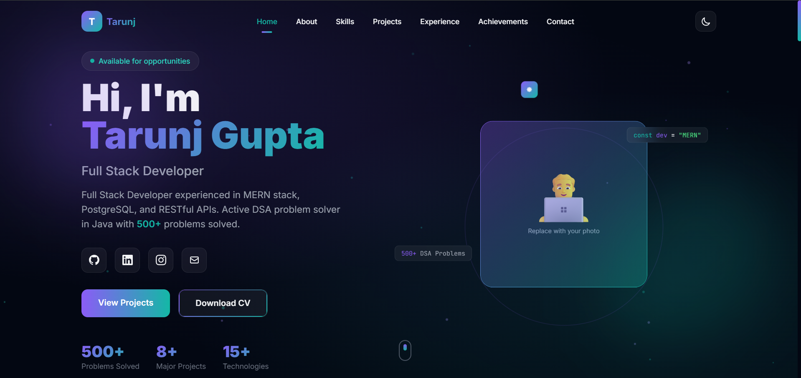

# 🚀 Day 10 — 60 Days Claude Challenge

## 🎯 Task Completed

* Built a **complete personal portfolio website** using AI
* Extracted real profile data from an existing portfolio and resume
* Generated a **premium, single-file HTML portfolio** with modern design
* Implemented **Purple + Teal** themed UI with dark/light mode
* Learned how AI enables **personal branding** without manual coding

---

## 🌍 Project: Personal Portfolio Website

A modern, responsive personal portfolio website built entirely using AI assistance — showcasing skills, projects, experience, achievements, and contact information in a visually stunning single-page design.

---

## ⚙️ Features Implemented

* 🏠 **Hero Section**

  * Name with gradient text styling
  * Typing animation cycling through roles
  * Social media links (GitHub, LinkedIn, Instagram, Email)
  * Animated stats counters (500+ Problems, 8+ Projects, 15+ Technologies)
  * Download CV button

* 👤 **About Me**

  * Professional bio with personal highlights
  * Interactive code-card design aesthetic
  * Location, education, and availability tags

* 💻 **Skills Section**

  * Animated progress bars for Languages, Frontend, and Backend
  * Categorized skill cards (Languages, Frontend, Backend, Tools)
  * Hover-interactive tool/platform tags

* 🛠 **Projects Showcase**

  * 5 featured project cards with hover overlay
  * GitHub and Live Demo links on each card
  * Tech stack tags for every project
  * Projects: Mangolyze, CueMaths, VendiQ, Food Ordering App, Voxa Chat

* 💼 **Experience & Education**

  * Timeline layout with visual indicators
  * Work experience at CodeAlpha (Frontend Developer)
  * Education timeline (B.Tech, XII, X)

* 🏆 **Achievements & Certifications**

  * 500+ DSA problems solved
  * Open source contribution to TheAlgorithms
  * Technical Lead at Technovation Club
  * AWS Cloud Certification
  * JavaScript Certification (HackerRank)

* 📬 **Contact Section**

  * Contact form with animated submit button
  * Direct contact cards (Email, Phone, LinkedIn, GitHub)

* 🎨 **Design & UX**

  * Dark/Light mode toggle with localStorage persistence
  * Glassmorphism cards and floating particle effects
  * Smooth scroll reveal animations
  * Active nav highlighting on scroll
  * Fully mobile responsive layout

---

## 🔧 Tech Stack Used

| Technology     | Purpose                        |
| -------------- | ------------------------------ |
| HTML5          | Page structure and semantics   |
| Tailwind CSS   | Styling via CDN (no build)     |
| Vanilla JS     | Animations, theme toggle, form |
| Google Fonts   | Inter + JetBrains Mono fonts   |
| SVG Icons      | Inline social & UI icons       |

---

## 📸 Screenshots

---

## 📚 Key Learnings

* **Personal Branding**
  Create a strong online professional presence using AI-generated websites that showcase your skills, projects, and achievements effectively.

* **AI Web Development**
  Generate complete, production-quality websites without writing code manually — Claude can build full portfolios from resume data and profile information.

* **Portfolio Building**
  A well-designed portfolio with project showcases, tech stacks, and live links significantly boosts credibility and visibility among recruiters.

* **Career Growth**
  Having a personal portfolio website improves discoverability and creates a lasting impression on hiring managers and collaborators.

* **Data Extraction with AI**
  AI can scrape and extract structured information from existing websites and resumes, transforming raw data into polished, recruiter-friendly content.

* **Design Without a Designer**
  Using AI, you can implement premium design patterns — glassmorphism, gradient themes, micro-animations, dark/light modes — without any design background.

---

## 🧠 Conclusion

Day 10 demonstrated the power of AI in **personal branding and web development**. By simply providing resume data and design preferences, Claude generated a complete, visually stunning portfolio website with modern animations, responsive design, and all essential sections. This approach empowers anyone — regardless of coding experience — to build a professional online presence that stands out to recruiters and peers alike.

---

## 🔗 References

* Claude AI — Portfolio generation from structured data
* Tailwind CSS CDN — Rapid styling without build tools
* Google Fonts — Inter & JetBrains Mono for modern typography
* Prompt Engineering — Using detailed prompts for precise output
* Web Design Principles:

  * Glassmorphism & modern UI patterns
  * Responsive design best practices
  * Micro-animation techniques for engagement

---
