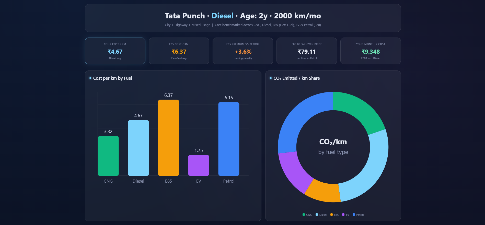
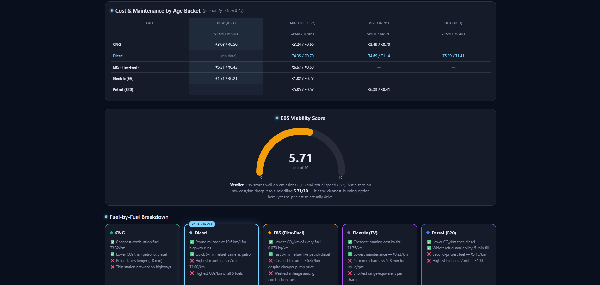

# 🚗 Day 17 – Vehicle Cost Analysis Dashboard (Tata Punch EV Focus)

### #60DayClaudeChallenge

---

## 📌 Task Overview

On Day 17, I explored how AI tools like Claude can act as a **data analyst** by transforming a raw CSV dataset into a **fully functional HTML dashboard**.

The goal was to analyze:
👉 *“Is switching to Tata Punch EV a better decision compared to other fuel options?”*

---

## ⚙️ Steps Followed

1. Read the provided resources
2. Downloaded the CSV dataset
3. Opened Claude and set effort level to *Low*
4. Collected vehicle details (usage, fuel type, mileage, etc.)
5. Uploaded the dataset into Claude
6. Used the Vehicle Cost Analysis Dashboard prompt
7. Generated a complete HTML dashboard
8. Reviewed:

   * KPI metrics
   * Fuel comparisons
   * Maintenance cost analysis
   * Environmental impact
9. Analyzed E85 economics and break-even point
10. Verified charts (SVG-based visualizations)
11. Saved the generated HTML file
12. Opened it in browser and captured screenshots
13. Uploaded all files to GitHub

---

## 📊 Dashboard Highlights

### 🔹 KPI Metrics

* Diesel Cost/km: ₹4.67
* EV Cost/km: ₹1.75
* Monthly Cost (Diesel): ₹9,348
* E85 Cost/km: ₹6.37
* Break-even (E85 vs Petrol): ₹79.11/litre

---

### 🔹 Key Insights

* ⚡ **Tata Punch EV is the most cost-efficient option (~₹1.75/km)**
* 💰 Switching from Diesel can reduce running cost by **~60%**
* 🔧 EV has the **lowest maintenance cost over time**
* 🌱 E85 is environmentally friendly but **not economically viable**
* 🚗 Diesel remains suitable for long highway usage

---

### 🔹 Visualizations Created

* 📊 Bar Chart → Cost per km comparison
* 🍩 Donut Chart → CO₂ emissions distribution
* 📈 Line Chart → Cost vs vehicle age (0–12 years)
* 📉 Gauge Chart → E85 viability score
* 📋 Table → Maintenance & lifecycle cost analysis

---

## 🧠 Learnings

Today’s biggest learning:

> Claude can act as a **data analyst capable of processing CSV datasets, calculating business metrics, generating visualizations, and building complete HTML dashboards.**

### 💡 Key Takeaways:

* 📂 CSV Analysis without writing code
* 📊 KPI-driven decision making
* 📉 Data visualization using SVG
* 🌍 Combining cost + environmental insights
* 🧠 Real-world analytics thinking (consulting style)

---

## 🚀 Outcome

* Built a **fully interactive HTML dashboard**
* Performed **real-world vehicle cost analysis**
* Understood **EV vs fuel economics**
* Applied **data storytelling + business insights**

---

## 📸 Screenshots

<!-- Add your dashboard screenshots here -->

---

## 📂 Files Included

* `dashboard.html`
* `dataset.csv`
* `screenshots/`
* `day17.md`

---

## 🔥 Reflection

This task showed me how AI is evolving from a coding assistant to a **full-stack data analyst**.

Instead of just writing code, I was able to:

* Generate insights
* Build dashboards
* Make data-driven decisions

👉 This is exactly how modern analytics workflows work in **consulting, business intelligence, and product teams**.

---

#️⃣ #60DayClaudeChallenge #Day17 #DataAnalytics #EV #ClaudeAI
