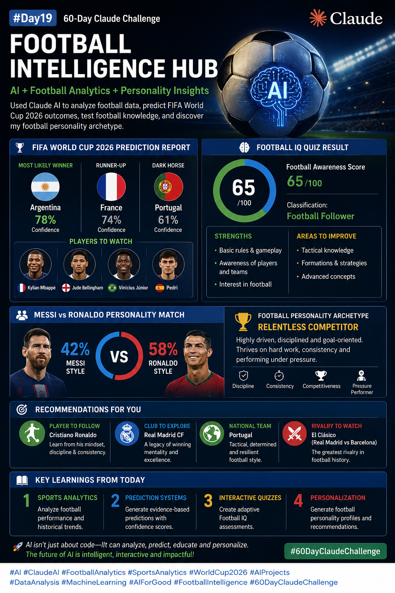

# 🚀 Day 19 – Football Intelligence Hub

### #60DayClaudeChallenge

---

## 📌 Task Overview

Today’s task was to build a **Football Intelligence Hub** using AI.
The goal was to simulate how AI can analyze sports data, generate predictions, create quizzes, and build personalized insights.

---

## ⚽ Stage 1 – FIFA World Cup 2026 Prediction Report

### 🏆 Predictions:

* **Winner:** Argentina (78% confidence)
* **Runner-up:** France (74% confidence)
* **Dark Horse:** Portugal (61% confidence)

### 👀 Players to Watch:

* Kylian Mbappé
* Jude Bellingham
* Vinícius Júnior
* Pedri

---

## 🧠 Stage 2 – Football IQ Quiz

### 📊 Football Awareness Score:

**65 / 100**

### 📈 Classification:

**Football Follower**

### ✅ Strengths:

* Basic rules & gameplay understanding
* Awareness of players and teams

### ⚠️ Areas to Improve:

* Tactical knowledge
* Formations & strategies
* Advanced football concepts

---

## 🧬 Stage 3 – Messi vs Ronaldo Personality Match

### ⚖️ Compatibility:

* Messi Style: 42%
* Ronaldo Style: 58%

### 🏹 Personality Archetype:

**Relentless Competitor**

### 📖 Description:

Highly driven, disciplined, and goal-oriented. Thrives on consistency, hard work, and performing under pressure.

---

## 🎯 Recommendations

* **Player to Follow:** Cristiano Ronaldo
* **Club to Explore:** Real Madrid
* **National Team:** Portugal
* **Rivalry:** El Clásico

---

## 📚 Key Learnings

1. **Sports Analytics**
   Analyze football performance and historical trends.

2. **Prediction Systems**
   Generate evidence-based predictions with confidence scores.

3. **Interactive Quizzes**
   Create adaptive Football IQ assessments.

4. **Personalization**
   Generate football personality profiles and recommendations.

---

## 📸 Screenshots

### 🔹 Final Profile

---

## 💡 Final Thoughts

This task demonstrated how AI can go beyond traditional use cases and combine:

* Data Analysis
* Predictive Modeling
* Interactive Learning
* Personalization

into a **single intelligent workflow**.

---

🔗 *GitHub Commit Link:* (Add your link here)
