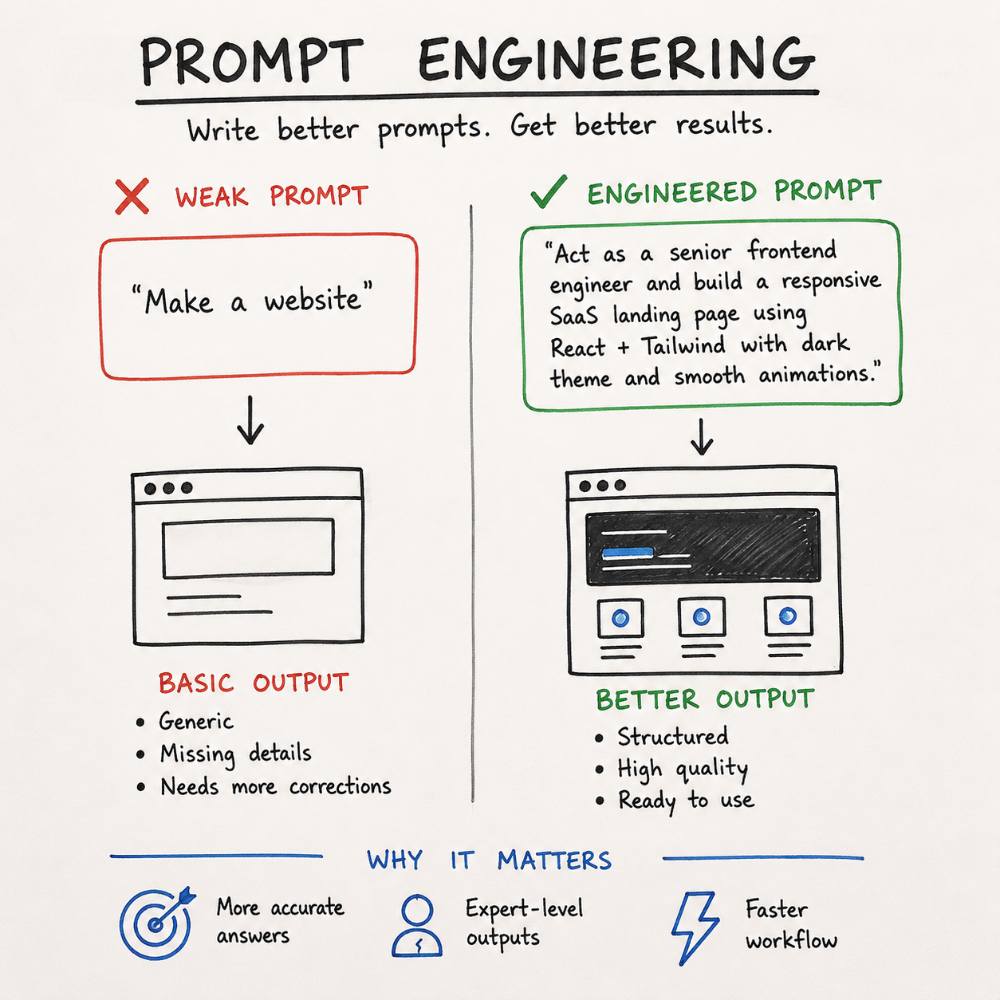
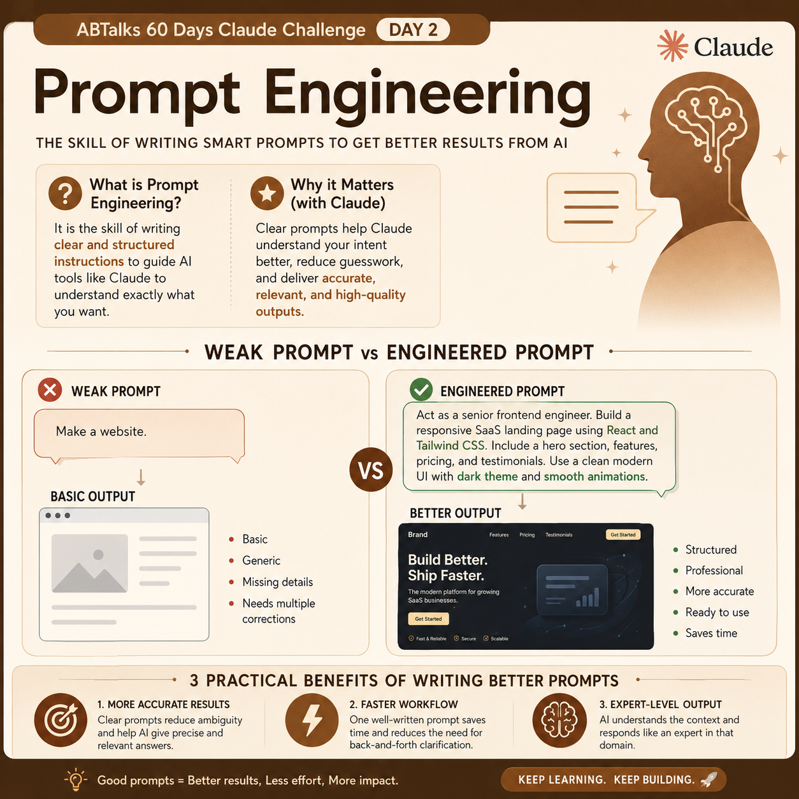

# 🚀 Day 2 — Prompt Engineering

## 🧠 What I Learned

Prompt Engineering is the skill of writing clear and structured prompts to get better results from AI.

Just like Googling well is a skill, prompting well is a modern tech skill.

---

## ⚡ Before vs After Prompt

### ❌ Weak Prompt

Create an image for Prompt engineering.

### 🔻 Output:
- Basic
- Generic
- Missing details
- Needs multiple corrections

---

### ✅ Engineered Prompt

You are an AI educator teaching complete beginners.
Explain Prompt Engineering in simple language.
Include:
* What Prompt Engineering is
* Why it matters when using AI tools like Claude
* One example of a weak prompt
* One example of an improved prompt
* Three practical benefits of writing better prompts
Also create a LinkedIn-ready image concept.
Image Requirements:
* Square LinkedIn post (1080×1080)
* Claude-inspired brown, beige and cream colors
* Professional and minimal design
* Main title: "Prompt Engineering"
* Show a visual comparison:
  * Weak Prompt → Basic Output
  * Engineered Prompt → Better Output
* Modern AI and productivity-themed visuals
add abtalks 60 days claude challenge in the heading
Output Format:
Section 1: Explanation
Section 2: Weak vs Improved Prompt Example
Section 3: Detailed Image Generation Prompt

### 🔻 Output:
- Structured
- Professional
- More accurate
- Ready-to-use

---

## 🎯 Key Takeaways

1. **More Accurate Answers**  
   → Clear prompts reduce guesswork  

2. **Expert-Level Output**  
   → Role + context = better results  

3. **Faster Workflow**  
   → One good prompt saves time  

---

## 📌 My Goal

Learn how to communicate better with AI  
so I can build faster and smarter systems.

---

#60DaysOfAI #PromptEngineering #Claude #Anthropic