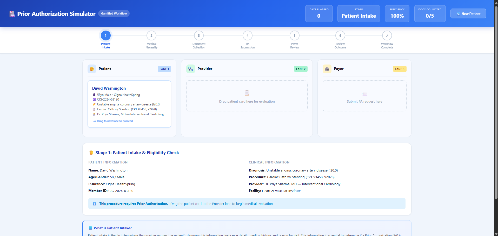

# Day 26: Prior Authorization Workflow Simulator

## 60-Day Claude Challenge

**Date:** June 27, 2026  
**Challenge:** Build a gamified, drag-and-drop Prior Authorization (PA) Workflow Simulator

---

## 🎯 What I Built

An interactive, single-file HTML application that simulates the complete US healthcare Prior Authorization workflow as a gamified, drag-and-drop experience. The simulator teaches users how PA processes work through hands-on interaction.

---

## ✨ Features Implemented

### Core Workflow
- **Three Workflow Lanes:** Patient, Provider, and Payer — representing the three parties in the PA process
- **Drag-and-Drop Movement:** Cases move between lanes via HTML5 drag-and-drop API
- **7-Stage Workflow:** Intake → Medical Necessity → Document Collection → Submission → Payer Review → Outcome → Complete
- **Multiple Outcomes:** Approval, Pend (additional info needed), Denial, with realistic probability distributions

### Patient Scenarios (4 cases)
| Scenario | Patient | Urgency | Docs Required |
|----------|---------|---------|---------------|
| Elective Surgery (Total Knee) | Margaret Thompson, 62F | Low | 6 |
| MRI Scan (Lumbar Spine) | Robert Chen, 45M | Medium | 5 |
| Specialty Medication (Biologic) | Lisa Patel, 38F | Medium | 6 |
| Inpatient Admission (Cardiac) | David Washington, 58M | High | 5 |

### Gamification
- **Efficiency Score:** Starts at 100%, penalized for invalid moves and denials, rewarded for fast document collection
- **Days Elapsed Counter:** Tracks time through the workflow based on realistic PA timelines
- **Progress Tracker:** Visual stage-by-stage progress bar at the top
- **Celebration Animation:** Confetti effect on approval
- **Graded Summary:** A/B/C/D efficiency grade at completion

### Educational Content
- Every workflow stage includes detailed educational explanations
- Covers medical necessity, document requirements, payer review processes, and appeal rights
- References real-world statistics (AMA survey data, CMS timelines)

### Appeal Process
- **Internal Appeal:** Provider submits additional documentation
- **Peer-to-Peer Review:** Physician-to-medical director conversation
- **External Review:** Referenced in educational content
- Realistic appeal overturn rates (40-60%)

---

## 🛠 Technical Details

- **Single HTML file** — no external dependencies
- **Vanilla JavaScript** — no frameworks, no CDNs
- **CSS-only animations** — confetti, progress indicators, transitions
- **In-memory state management** — no localStorage
- **Editable scenario data** — SCENARIOS array at top of script
- **HTML5 Drag & Drop API** — native browser support
- **Responsive design** — works on mobile and desktop
- **Blue color palette** with black text for readability

---

## 📚 Key Learnings

1. **Prior Authorization is complex:** The PA process involves multiple parties, document requirements, and decision pathways — simulating it required careful state machine design
2. **Drag-and-drop state management:** Coordinating drag events between multiple drop zones and validating moves based on workflow state requires careful event handling
3. **Gamification drives engagement:** Adding scores, timers, and celebrations transforms a dry workflow tutorial into an engaging learning experience
4. **Educational content integration:** Showing contextual explanations at each stage helps users understand *why* each step exists, not just *what* happens
5. **Healthcare workflow timelines:** Real PA timelines vary from 3 days (urgent) to 14+ days (elective), with appeals adding significant additional time

---

## 📸 Screenshots

*Screenshots of the completed workflow and dashboard to be added*

---

## 🔗 Files

- `Day26.html` — Complete Prior Authorization Workflow Simulator
- `Day26.md` — This documentation file
