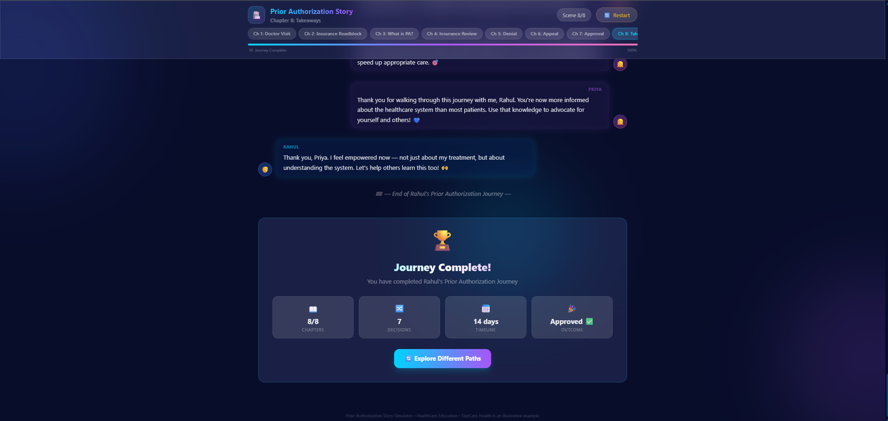

# Day 27: Prior Authorization Story Simulator

## 60-Day Claude Challenge

**Date:** June 28, 2026  
**Challenge:** Build an interactive story simulator teaching Prior Authorization through Rahul's healthcare journey

---

## 🎯 What I Built

A futuristic, chat-based interactive story simulator that teaches the US healthcare Prior Authorization (PA) process through an engaging narrative. Follow Rahul, a 32-year-old patient diagnosed with Rheumatoid Arthritis, as Priya, a healthcare operations specialist, guides him through diagnosis, insurance submission, denial, appeal, and ultimate approval.

---

## ✨ Features Implemented

### Story & Characters
- **👦 Rahul** — Patient character, chat bubbles appear on the left with blue neon glow
- **👧 Priya** — Healthcare operations specialist, chat bubbles appear on the right with purple neon glow
- **🩺 Dr. Patel / Narrators** — Centered italic text (not chat bubbles)
- **🏦 StarCare Health** — Illustrative payer example labeled throughout

### 8 Interactive Chapters
| Chapter | Title | Key Content |
|---------|-------|-------------|
| 1 | Doctor Visit | RA diagnosis, Humira prescription, PA introduction |
| 2 | Insurance Roadblock | PA submission flow: Provider → Payer |
| 3 | What is PA? | Plain-language explanation, step therapy, AMA 2023 stats |
| 4 | Insurance Review | Eligibility, clinical docs, ICD-10 match, step therapy |
| 5 | Denial | Missing step therapy documentation, denial ≠ permanent |
| 6 | Appeal | Document gathering, Letter of Medical Necessity |
| 7 | Approval | PA approved, saved on file permanently |
| 8 | Takeaways | Patient perspective + System-level metrics |

### Interactive Elements
- **2 choices after every scene** — influences dialogue and story progression
- **Branching dialogue paths** — different variant text based on player choices
- **Progress bar** — visual progress across all 8 chapters
- **Typing indicators** — animated dots before each message appears
- **Celebration animation** — confetti on story completion

### UI Design (Futuristic Glassmorphism)
- Dark cosmos background (#080d2a) with floating ambient orbs
- Glassmorphism panels with backdrop-filter blur
- Neon glow borders (blue for Rahul, purple for Priya, green for doctor)
- Smooth animations — slide-left, slide-right, fade-in, float
- Responsive design — works on mobile and desktop

---

## 🛠 Technical Details

- **Tailwind CSS CDN** — as specified in requirements
- **Vanilla JavaScript** — no frameworks
- **createElement + appendChild** — never innerHTML on chat container
- **In-memory state** — no localStorage
- **Editable story data** — STORY_SCENES array at top of script
- **HTML5 smooth scrolling** — auto-scrolls to latest message
- **Branching narrative** — messagesMap with variant keys

---

## 📚 Key Learnings

1. **DOM manipulation discipline:** Using createElement + appendChild exclusively (never innerHTML on container) ensures proper DOM tree management and prevents XSS-style issues
2. **Branching narratives:** Managing story variants through a messagesMap structure keeps dialogue data clean and extensible
3. **Chat UI timing:** Realistic typing indicators and read delays make the conversation feel natural — too fast feels robotic, too slow feels frustrating
4. **Healthcare education through story:** Embedding AMA statistics and PA process details within a character-driven narrative makes dry operational content engaging and memorable
5. **Glassmorphism UI:** Combining backdrop-filter, semi-transparent backgrounds, neon glows, and ambient orbs creates a premium futuristic aesthetic

---

## 📸 Screenshots

*Screenshots of key story scenes and completion dashboard to be added*

---

## 🔗 Files

- `Day27.html` — Complete Prior Authorization Story Simulator
- `Day27.md` — This documentation file
