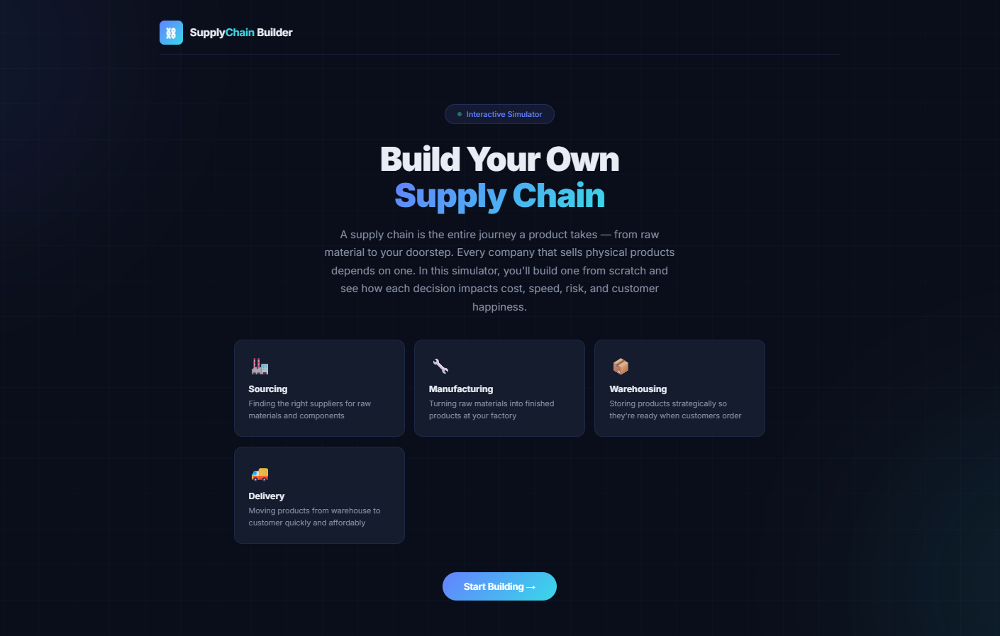

# Day 30: Supply Chain Builder — Interactive Optimizer Simulator

## 📋 Challenge
Build an interactive Supply Chain Builder simulator that teaches beginners how supply chains work through hands-on decision making, with live business metrics and a final optimization dashboard.

## 🛠️ What I Built
A premium single-file React application — **Supply Chain Builder** — that generates a random company and guides users through five strategic supply chain decisions:

1. **Supplier Strategy** — Single, Dual, or Multi-Source
2. **Factory Location** — Domestic, Nearshore, or Offshore
3. **Warehouse Strategy** — Central, Regional, or Micro-Fulfillment
4. **Transportation Method** — Road, Rail, Sea, or Air
5. **Inventory Strategy** — Lean (JIT), Balanced, or High Safety Stock

Each decision updates five live metrics: **Cost Efficiency, Delivery Speed, Risk Resilience, Customer Satisfaction, and Sustainability**. At the end, a comprehensive dashboard displays an Overall Supply Chain Score (0–100), grade, strengths, weaknesses, biggest risk, and three actionable improvements.

## 🖥️ Tech Stack
- **React 18** via CDN with Babel JSX
- **Vanilla CSS** with CSS custom properties (design tokens)
- **Single HTML file** — runs offline, no dependencies

## 📸 Screenshots

### Welcome Screen

## 🎯 Key Learnings

### 1. Optimization Strategy
Supply chain optimization is about making **continuous improvements** rather than rebuilding everything from scratch. Small, strategic adjustments — like adding a second supplier or shifting from air to rail freight — can dramatically improve overall performance without the cost and risk of a complete overhaul.

### 2. Business Trade-offs
Every supply chain decision involves balancing **five competing priorities**: cost, speed, risk, sustainability, and customer satisfaction. There is no perfect answer — only the best fit for your specific business context. For example, air freight maximizes speed but destroys cost efficiency and sustainability. Understanding these trade-offs is the core skill of supply chain management.

### 3. Supply Chain Fundamentals
Sourcing, manufacturing, warehousing, transportation, and inventory are not isolated decisions — they form an **interconnected system**. A choice made at the supplier level ripples through to delivery speed and customer satisfaction. Dual sourcing combined with regional warehouses and rail freight creates a resilient, balanced chain that scores consistently high across all metrics.

### 4. React Enterprise Simulations
Claude can generate complete, interactive enterprise-grade simulations in a single file. This project demonstrated how to build a multi-step wizard with state management (`useState`), reusable components, animated metrics, weighted scoring algorithms, and dynamic analysis — all shipping as one portable HTML file.

## 🏆 Optimal Strategy (Maximum Score)
Through algorithmic analysis of the scoring engine:

| Decision | Optimal Choice | Why |
|----------|---------------|-----|
| Supplier | Dual Sourcing | Best weighted impact (+5.4); avoids single-point failure |
| Factory | Domestic | Highest individual boost (+7.1); speed + satisfaction |
| Warehouse | Regional Centers | Strong balance (+5.1); 2-3 day delivery coverage |
| Transport | Rail Freight | Best overall (+3.7); cost-effective + sustainable |
| Inventory | Balanced Buffer | Goldilocks approach (+4.9); no metric sacrificed |

**Result**: Grade A (80–86) depending on industry. Fresh Foods scores highest at 86.

## 📂 Files
- `Day30.html` — Complete Supply Chain Builder application

## 🔗 Resources
- [60-Day Claude Challenge](https://github.com/tarunjaigupta/60-day-claude-challenge)

---
*Day 30 of the 60-Day Claude Challenge — Completed on July 1, 2026*
