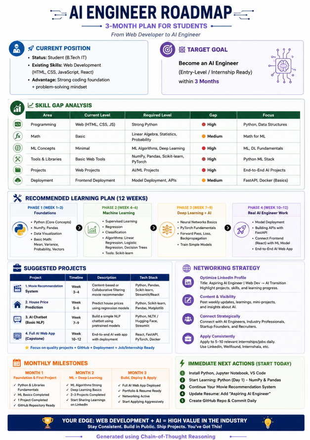

# 🚀 Day 4/60 — Chain-of-Thought Prompting

## 📌 Overview

Today, I learned how **Chain-of-Thought Prompting** improves AI output by forcing the model to reason step-by-step instead of jumping directly to an answer.

Instead of asking AI for generic responses, I guided it to:

* Analyze my situation
* Identify skill gaps
* Suggest actionable steps
* Generate a structured roadmap

---

## 🧠 What is Chain-of-Thought Prompting?

Chain-of-Thought Prompting is a technique where we guide AI to **think step-by-step** before giving a final answer.

👉 Instead of:

> “Give me a roadmap”

👉 We use:

> “Analyze my current situation → identify gaps → suggest plan → create roadmap”

This leads to **better reasoning and structured outputs**.

---

## 💡 Key Learnings

### 1. Better Reasoning

Breaking problems into steps improves depth and accuracy.

### 2. More Reliable Outputs

AI evaluates assumptions before giving answers.

### 3. Personalized Solutions

Outputs become tailored to your specific situation.

### 4. Real-World Applications

* Career Planning
* Business Strategy
* Decision Making
* Project Planning

---

## 🛠 Task Performed Today

I used Chain-of-Thought Prompting to create a **Personalized AI Career Roadmap**.

### 🎯 Goal:

Become an **AI Engineer in 3 months**

### 📊 What AI Did:

* Analyzed my current skills (Web Development)
* Identified missing skills (Python, ML, DL)
* Suggested learning roadmap
* Recommended real-world projects
* Created milestones and action plan

---

## 📄 Generated Roadmap Summary

### 🚀 Current Position

* Student (B.Tech IT)
* Skills: Web Development

### 🎯 Target Goal

* Become an AI Engineer (3 months)

### 📈 Skill Gaps

* Python Programming
* Machine Learning Concepts
* Deep Learning
* Model Deployment

### 🛠 Learning Plan

* Python + Libraries (NumPy, Pandas)
* Machine Learning (Scikit-learn)
* Deep Learning (PyTorch Basics)
* Deployment (FastAPI + React)

### 💼 Projects

1. Movie Recommendation System
2. House Price Prediction
3. AI Chatbot
4. Full AI Web App (Capstone)

### 📅 Milestones

* Month 1: Foundations + 1 Project
* Month 2: ML + 2 Projects
* Month 3: Full AI App + Apply for roles

---

### 🔹 Prompt Used

```
You are an Elite AI Career Strategist.

Your goal is to build a personalized roadmap for me.

Before creating the roadmap, ask me ONLY these 4 questions:

Question 1
What is your current situation?
Examples:
• Student
• Working Professional
• Freelancer
• Founder
• Career Switcher

Question 2
What skills do you currently have?
Examples:
• Python
• Marketing
• Sales
• Design
• Web Development
• Data Analysis

Question 3
What is your target goal?
Examples:
• Get a job
• Land an internship
• Become a Data Scientist
• Become an AI Engineer
• Start a business
• Grow on LinkedIn

Question 4
What is your target timeline?
Examples:
• 3 months
• 6 months
• 1 year
• 2 years

After collecting all answers:

Think step by step.

1. Analyze my current position.
2. Identify strengths.
3. Identify skill gaps.
4. Identify the fastest path to the goal.
5. Recommend learning priorities.
6. Recommend projects.
7. Recommend networking strategy.
8. Create milestones.

Finally generate a visually structured ONE-PAGE roadmap.

The roadmap must contain:

🚀 Current Position
🎯 Target Goal
📈 Skill Gap Analysis
🛠 Recommended Learning Plan
💼 Suggested Projects
🌐 Networking Strategy
📅 Monthly Milestones
⚡ Immediate Next Actions

PDF DESIGN REQUIREMENTS:

• A4 Portrait Layout
• Professional consulting-report style
• Clean sections with visual hierarchy
• Tables wherever appropriate
• No overlapping text
• Use concise content
• Use visual dividers
• Maximum one page
• Export-ready PDF format
• Easy to screenshot and share on LinkedIn

End with:

Generated using Chain-of-Thought Reasoning
```

### 🔹 AI Generated Roadmap




## 🧩 Capsule Hub Observations

* Prompt capsules help **reuse structured prompts**
* Saves time when working on repetitive tasks
* Makes prompting more **systematic and efficient**
* Helps maintain consistency in outputs

💡 Insight:

> Prompting is not just asking questions — it’s designing reusable thinking frameworks.

---

## ⚡ Key Takeaway

The quality of AI output depends on:
👉 How well you **structure the thinking process**

Not just the tool.

---

## 🔗 Reflection

Today was a shift from:
❌ Asking AI for answers
✅ Designing how AI thinks

This approach will be extremely useful in:

* Career planning
* Building projects
* Making better decisions

---

## 🏁 Conclusion

Chain-of-Thought Prompting is a **powerful technique** that transforms AI from a simple tool into a **strategic assistant**.

