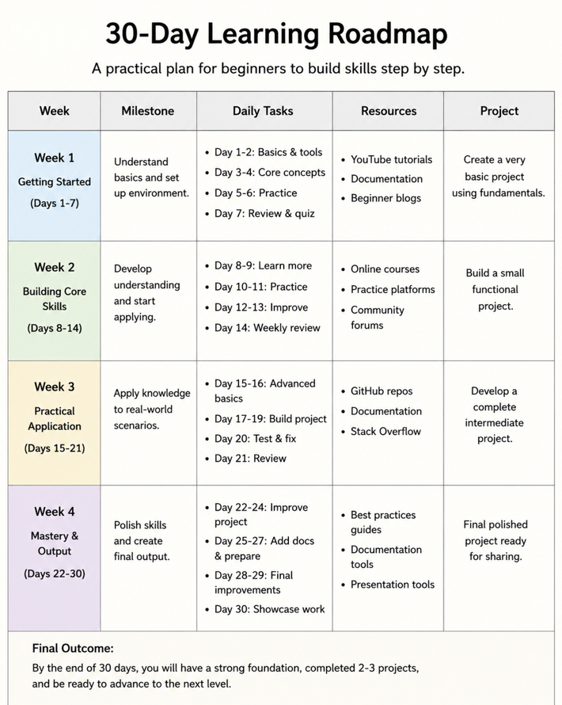
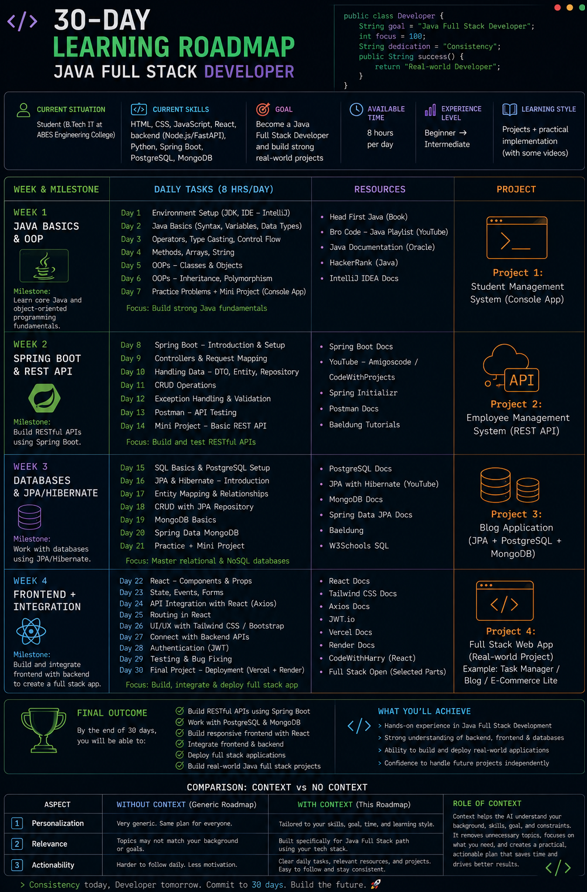

🚀 Day 5 — Context Engineering | 60DaysClaudeChallenge
📌 Task Overview

Today’s focus was understanding Context Engineering — how providing structured input improves AI-generated outputs.

🔹 Prompt A (Without Context)

Prompt Used:

Create a 30-day learning roadmap.

Include:
- Weekly milestones
- Daily tasks
- Resources
- Projects
- Final outcome

Make it practical and beginner-friendly.
✅ Output Summary:
Generic roadmap
No personalization
Applicable to anyone
Lacked direction based on specific goals

📷 Screenshot:

🔹 Prompt B (With Context)

Prompt Used:

Create a 30-day learning roadmap.

Context:
- Current Situation: Student
- Current Skills: HTML, CSS, JavaScript, React, backend (Node.js/FastAPI), Python, Spring Boot, PostgreSQL, MongoDB
- Goal: Become a Java Full Stack Developer and build strong real-world projects
- Available Time: 8 hours per day
- Experience Level: Beginner → Intermediate
- Preferred Learning Style: Projects + practical implementation

Include:
- Weekly milestones
- Daily tasks
- Resources
- Projects
- Final outcome

Make it practical and beginner-friendly.
✅ Output Summary:
Fully personalized roadmap
Focused on Java Full Stack (Spring Boot, DBs, APIs)
Included real-world projects
Structured based on 8 hrs/day schedule
Clear and actionable

📷 Screenshot:

⚖️ Comparison: Prompt A vs Prompt B
1. Which roadmap feels more personalized?

👉 Prompt B (With Context)
Because it aligns with my skills, goal, and time availability.

2. Which roadmap would you actually follow?

👉 Prompt B
It is practical, relevant, and directly applicable to my learning path.

3. What role did context play?

👉 Context transformed the output from:

Generic → Personalized
Broad → Specific
Passive → Actionable

It helped the AI understand:

My background
My tech stack
My goal
My constraints
🧠 Key Learnings
Context is everything in AI prompting
Better inputs = Better outputs
AI becomes more useful when guided properly
Always include:
Goal
Current skills
Time availability
Learning preference
🚀 Conclusion

Context Engineering turns AI from:

A general tool
into
A personalized mentor