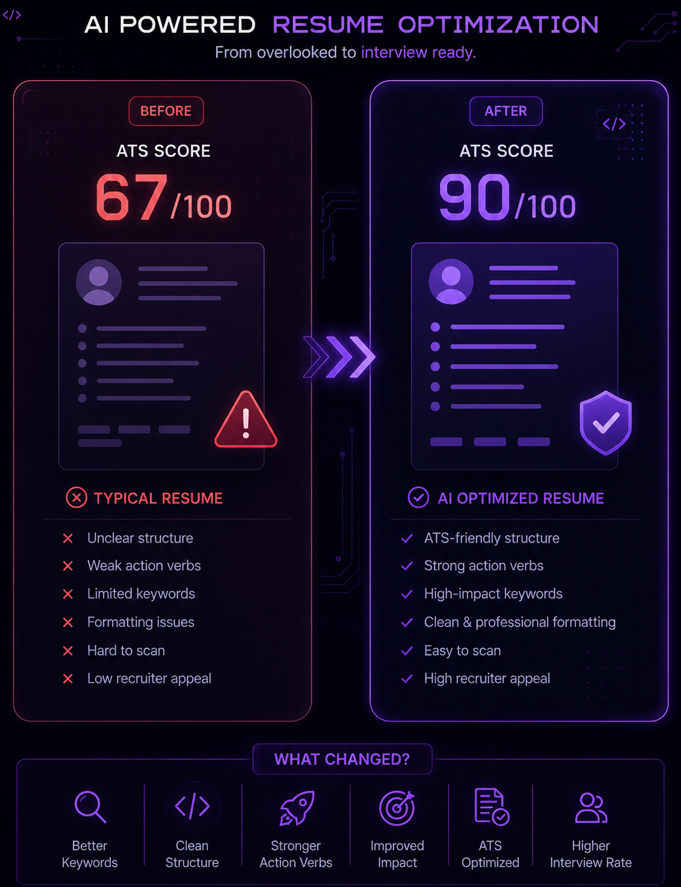
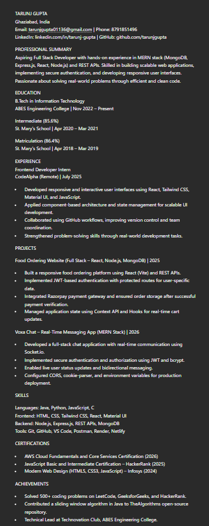

# 🚀 Day 6 — Resume Optimization with AI (60DayClaudeChallenge)

## 📌 Objective

Learn how to optimize a resume for **ATS (Applicant Tracking Systems)** and improve recruiter readability using AI tools.

---

## 📄 Original Resume

* File: `Resume_2026.pdf`
* ATS Score (Before Optimization): **68/100**
* Key Issues:

  * Generic summary section
  * Weak action verbs
  * Poor keyword optimization
  * Formatting inconsistencies
  * Use of "Click Here" links (not ATS-friendly)
  * Less impact-focused bullet points

---

## 🤖 AI Optimization Process

* Used **Claude AI** with a Resume Optimizer prompt
* Steps followed:

  1. Uploaded original resume
  2. Generated ATS analysis
  3. Identified gaps in keywords and formatting
  4. Rewrote content using strong action verbs
  5. Structured resume into ATS-friendly format
  6. Generated a clean **one-page resume**

---

## ✅ Optimized Resume

* File: `Tarunj_Gupta_Optimized_Resume.pdf`
* ATS Score (After Optimization): **91/100**

### 🔧 Key Improvements:

* Standardized section headings (Summary, Education, Experience, Projects, Skills)
* Improved keyword density (MERN, REST API, JWT, Socket.io)
* Replaced weak phrases with impact-driven bullet points
* Removed unnecessary words and redundancy
* Improved formatting consistency
* Made resume concise and easy to scan
* Replaced non-ATS-friendly links

---

## 📸 Screenshots

### 1. ATS Score Comparison

### 2. Final Optimized Resume Preview

---

## 📚 Key Learnings

* ATS systems filter resumes before recruiters see them
* Keywords play a crucial role in resume visibility
* Simple and structured formatting is more effective than fancy designs
* Action verbs + measurable impact = stronger resume
* One-page resumes are more effective for students
* AI tools can significantly improve resume quality when used correctly

---

## 🎯 Outcome

* Built an **ATS-optimized, recruiter-ready resume**
* Improved resume clarity, structure, and keyword alignment
* Increased chances of getting shortlisted for interviews

---

## 🔗 Repository Update

* Created `Day6/` folder
* Added:

  * `day6.md`
  * Original Resume
  * Optimized Resume
  * Screenshots

---

## 💡 Final Thoughts

This was one of the most practical days in the challenge.
A well-optimized resume can directly impact **job opportunities and interview calls**.

---

#60DayClaudeChallenge #Day6 #ResumeOptimization #ATS #AI #CareerGrowth
