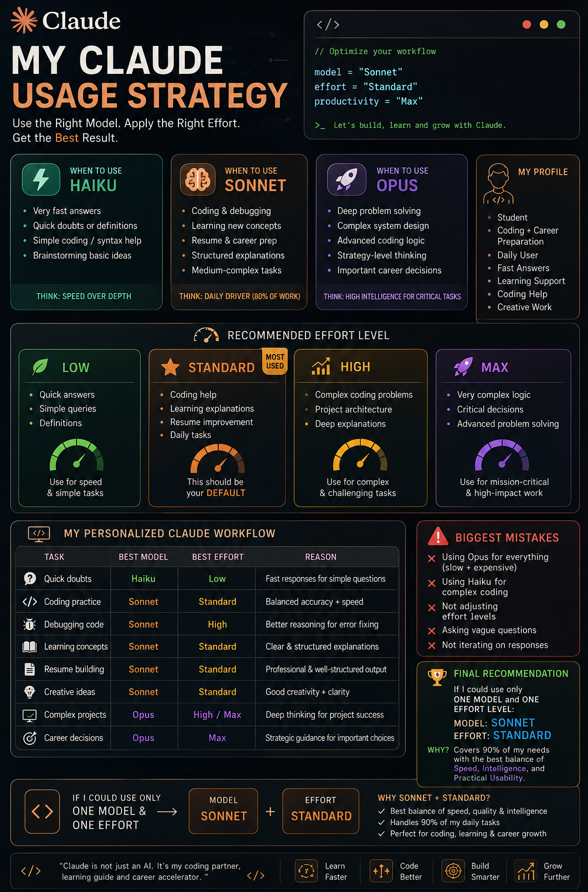

# 🚀 My Claude Usage Strategy

---

## 🎯 Recommended Primary Model

**Sonnet**

---

## 💡 Why This Model Fits Me

* Balanced for **coding + learning + career preparation**
* Fast enough for daily use, but still **intelligent and structured**
* Handles:

  * Code generation & debugging
  * Resume improvement
  * Concept explanations
  * Creative ideas

👉 Best mix of **speed + quality** for a student using Claude daily

---

## ⚡ When to Use Haiku

Use Haiku when:

* You need **very fast answers**
* Quick doubts or definitions
* Simple coding syntax help
* Brainstorming basic ideas

👉 Think: *Speed over depth*

---

## 🧠 When to Use Sonnet

Use Sonnet when:

* Writing or debugging code
* Learning new concepts deeply
* Resume building & career prep
* Structured explanations
* Medium-complex tasks

👉 Think: *Daily driver (80% of your work)*

---

## 🚀 When to Use Opus

Use Opus when:

* Deep problem solving
* Complex system design
* Advanced coding logic
* Strategy-level thinking
* Important career decisions

👉 Think: *High intelligence for critical tasks*

---

## ⚙️ Recommended Effort Level

### 🟢 Low

* Quick answers
* Simple queries
* Definitions

---

### 🔵 Standard (Most Used)

* Coding help
* Learning explanations
* Resume improvement
* Daily tasks

👉 This should be your **default**

---

### 🟡 High

* Complex coding problems
* Project architecture
* Deep explanations

---

### 🔴 Max

* Very complex logic
* Critical decisions
* Advanced problem solving

---

## 🔄 My Personalized Claude Workflow

| Task              | Best Model | Best Effort | Reason                    |
| ----------------- | ---------- | ----------- | ------------------------- |
| Quick doubts      | Haiku      | Low         | Fast responses            |
| Coding practice   | Sonnet     | Standard    | Balanced accuracy + speed |
| Debugging code    | Sonnet     | High        | Better reasoning          |
| Learning concepts | Sonnet     | Standard    | Clear explanations        |
| Resume building   | Sonnet     | Standard    | Structured output         |
| Creative ideas    | Sonnet     | Standard    | Good creativity + clarity |
| Complex projects  | Opus       | High/Max    | Deep thinking             |
| Career decisions  | Opus       | Max         | Strategic guidance        |

---

## ❌ Biggest Mistakes I Should Avoid

* Using **Opus for everything** (slow + expensive)
* Using **Haiku for complex coding**
* Not adjusting effort levels
* Asking vague questions
* Not iterating on responses

---

## ✅ Final Recommendation

If I could use only **ONE model and ONE effort level**:

👉 **Model:** Sonnet
👉 **Effort:** Standard

### Why?

* Covers **90% of my needs**
* Best balance of:

  * Speed ⚡
  * Intelligence 🧠
  * Practical usability 🎯

---

## 🎉 Conclusion

This strategy helps me:

* Learn faster
* Code better
* Make smarter career decisions

By choosing the **right model + effort**, I can use Claude like a **power tool instead of a basic chatbot**.

---
