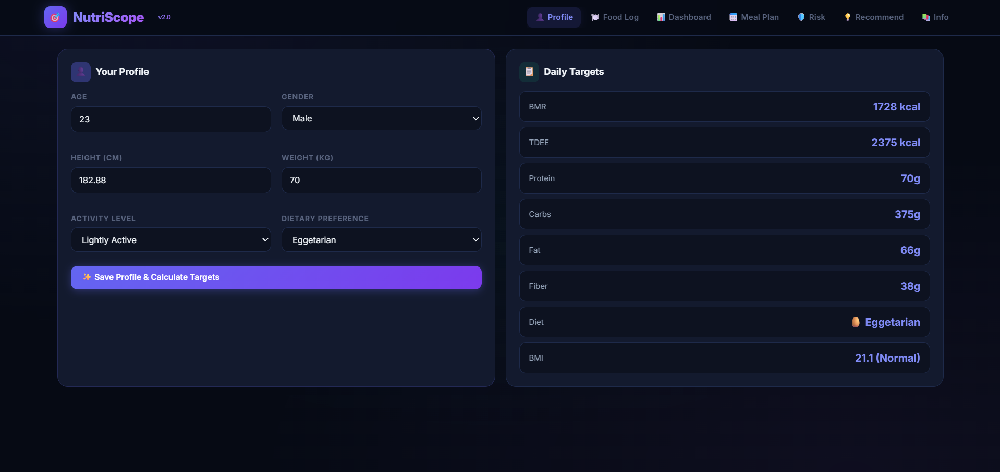
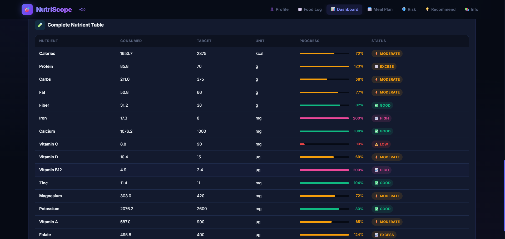
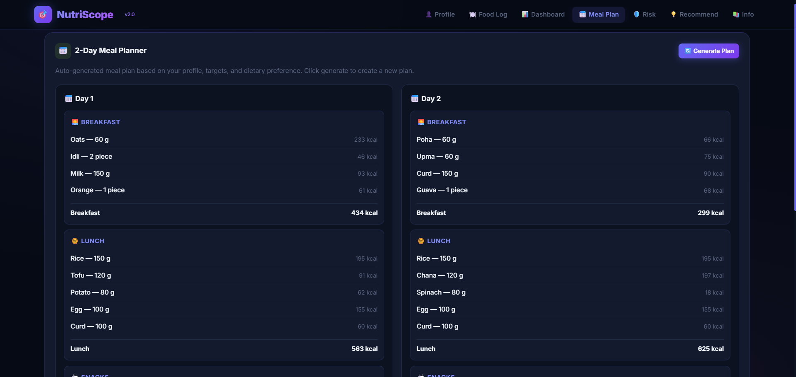
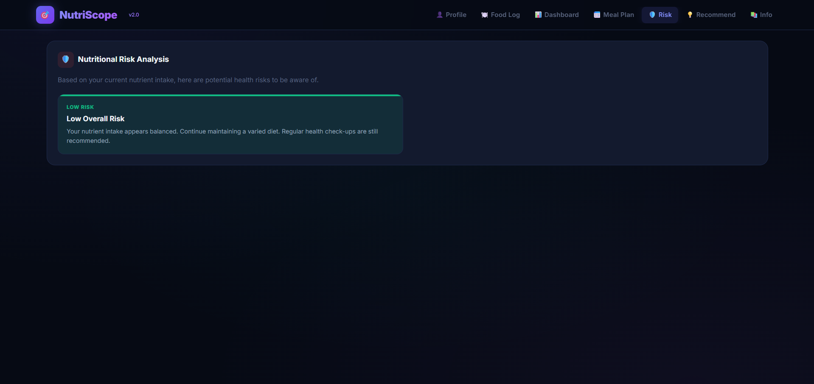
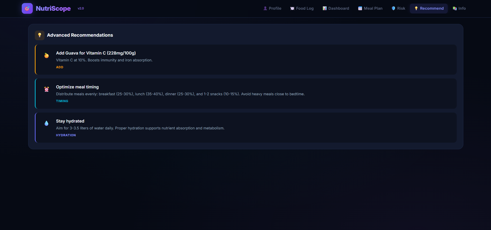
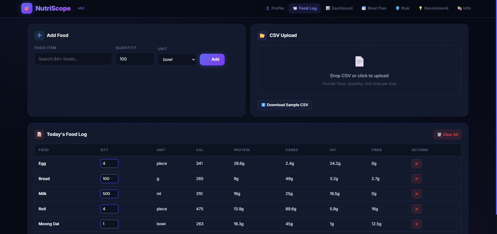
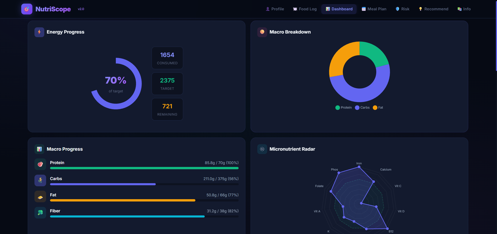
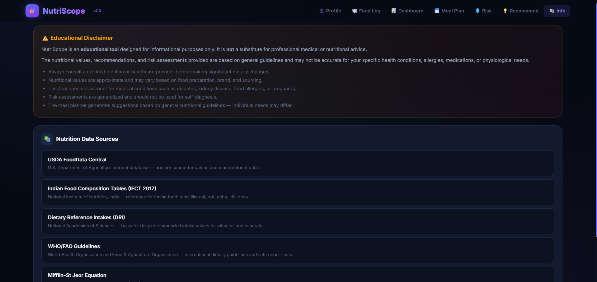

# 🚀 Day 9 — 60 Days Claude Challenge

## 🎯 Task Completed

* Built an MVP version of **NutriScope (Diet Analyzer)**
* Generated a **downloadable HTML application**
* Enhanced the application using iterative prompting
* Compared MVP vs Enhanced version
* Captured screenshots of the application

---

## 🌍 Project: NutriScope

NutriScope is an AI-powered diet and nutrition analysis tool that helps users track, analyze, and optimize their daily food intake.

---

## ⚙️ Features Implemented

* 👤 **User Profile System**

  * Age, height, weight, activity level
  * Automatic calculation of BMR, TDEE, BMI

* 🍽 **Food Logging System**

  * Manual food entry
  * CSV upload support

* 📊 **Interactive Dashboard**

  * Energy tracking
  * Macro breakdown (Protein, Carbs, Fat)
  * Micronutrient analysis

* 📈 **Complete Nutrient Table**

  * Consumed vs Target comparison
  * Status indicators (Low, Moderate, High, Good)

* ⚠️ **Nutritional Risk Analysis**

  * Detects deficiencies and excess nutrients
  * Provides health insights

* 💡 **AI Recommendations**

  * Diet improvements
  * Hydration suggestions
  * Meal timing optimization

* 🥗 **Meal Planner**

  * Auto-generated 2-day meal plan

* 📉 **Data Visualization**

  * Progress bars
  * Pie chart (Macro breakdown)
  * Radar chart (Micronutrients)

---

## 🔄 MVP vs Enhanced Version

### 🟢 MVP Version

* Basic UI
* Simple food tracking
* Limited insights

### 🔵 Enhanced Version

* Full dashboard with analytics
* Advanced recommendations
* Risk analysis system
* Better UI/UX and visualization

---

## 📸 Screenshots

### 1. Dashboard View

### 2. Nutrition Table

### 3. Meal Planner

### 4. Risk Analysis

### 5. Recommendations

### 6. Food Log

### 7. Profile & Targets

### 8. Data Sources / Info Section

---

## 📚 Key Learnings

* **MVP First Approach**
  Build a working version before adding complexity

* **Iterative Development**
  Improve outputs using multiple focused prompts

* **Claude Artifacts**
  Can generate real, interactive applications

* **AI Product Thinking**
  Build → Test → Improve (like real developers)

---

## 🧠 Conclusion

This day helped me understand that building with AI is not about getting perfect results in one go, but about **iterating smartly and progressively improving the output**.

---

## 🔗 References

* Claude AI (Artifacts Feature)
* Prompt Engineering Techniques
* Nutrition Data Sources:

  * USDA FoodData Central
  * IFCT 2017 (Indian Food Tables)
  * WHO/FAO Guidelines

---
